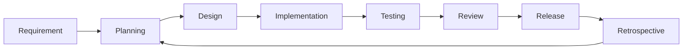

# Quản lý phòng trọ - SPQM Level 1

Mini project môn **Software Process and Quality Management** với đề tài quản lý phòng trọ ở **Level 1 - Nền tảng**.

## Mô tả hệ thống

Hệ thống cung cấp REST API để quản lý phòng trọ, người thuê, hợp đồng thuê phòng và hóa đơn tháng. Mục tiêu là tạo một sản phẩm nhỏ nhưng có quy trình phát triển cơ bản: tách lớp, kiểm thử đơn vị, kiểm tra chất lượng code, CI và tài liệu quy trình.

## Công nghệ sử dụng

- Backend: Node.js, Express
- Database: SQLite
- Unit test: Jest
- API test: Supertest
- Code quality: ESLint
- CI: GitHub Actions

## Cấu trúc project

```text
.
├── .github/workflows/ci.yml
├── docs/spqm-level-1.md
├── src
│   ├── app.js
│   ├── server.js
│   ├── controllers
│   ├── middlewares
│   ├── models
│   │   └── database.js
│   ├── routes
│   ├── services
│   └── utils
├── tests
│   ├── helpers
│   ├── app.test.js
│   ├── contractService.test.js
│   ├── invoiceService.test.js
│   └── roomService.test.js
├── package.json
└── README.md
```

## Database schema SQLite

### rooms

| Field | Type | Ghi chú |
| --- | --- | --- |
| id | INTEGER | Primary key |
| name | TEXT | Tên phòng, duy nhất |
| floor | INTEGER | Tầng |
| area | REAL | Diện tích |
| price | INTEGER | Giá thuê tháng |
| status | TEXT | `available`, `rented`, `maintenance` |
| description | TEXT | Ghi chú |

Ánh xạ trạng thái phòng:

- `available`: trống
- `rented`: đã thuê
- `maintenance`: bảo trì

### tenants

| Field | Type | Ghi chú |
| --- | --- | --- |
| id | INTEGER | Primary key |
| full_name | TEXT | Họ tên |
| phone | TEXT | Số điện thoại |
| email | TEXT | Email |
| identity_number | TEXT | CCCD/CMND |
| address | TEXT | Địa chỉ |

### contracts

| Field | Type | Ghi chú |
| --- | --- | --- |
| id | INTEGER | Primary key |
| room_id | INTEGER | Foreign key đến rooms |
| tenant_id | INTEGER | Foreign key đến tenants |
| start_date | TEXT | Ngày bắt đầu |
| end_date | TEXT | Ngày kết thúc |
| deposit | INTEGER | Tiền cọc |
| monthly_rent | INTEGER | Tiền thuê tháng |
| status | TEXT | `active`, `ended` |

### invoices

| Field | Type | Ghi chú |
| --- | --- | --- |
| id | INTEGER | Primary key |
| contract_id | INTEGER | Foreign key đến contracts |
| month | TEXT | Tháng, định dạng `YYYY-MM` |
| room_fee | INTEGER | Tiền phòng |
| electricity_fee | INTEGER | Tiền điện |
| water_fee | INTEGER | Tiền nước |
| service_fee | INTEGER | Tiền dịch vụ |
| total_amount | INTEGER | Tổng tiền |
| payment_status | TEXT | `unpaid`, `paid` |

## Cài đặt

```bash
npm install
```

## Chạy project

```bash
npm start
```

Server mặc định chạy tại:

```text
http://localhost:3000
```

Kiểm tra health check:

```text
GET /health
```

## Chạy kiểm tra chất lượng và test

```bash
npm run lint
npm test
```

Coverage tối thiểu được cấu hình trong `package.json` là 70% cho statements, branches, functions và lines.

## Chuẩn JSON response

Thành công:

```json
{
  "success": true,
  "message": "Room created",
  "data": {}
}
```

Thất bại:

```json
{
  "success": false,
  "message": "Missing required fields",
  "details": {
    "fields": ["price"]
  }
}
```

## Danh sách API

### Rooms

| Method | Endpoint | Mô tả |
| --- | --- | --- |
| POST | `/api/rooms` | Thêm phòng |
| GET | `/api/rooms` | Xem danh sách phòng |
| GET | `/api/rooms/:id` | Xem chi tiết phòng |
| PUT | `/api/rooms/:id` | Cập nhật phòng |
| DELETE | `/api/rooms/:id` | Xóa phòng |

Body tạo phòng:

```json
{
  "name": "A101",
  "floor": 1,
  "area": 20,
  "price": 2500000,
  "status": "available",
  "description": "Phòng có ban công"
}
```

### Tenants

| Method | Endpoint | Mô tả |
| --- | --- | --- |
| POST | `/api/tenants` | Thêm người thuê |
| GET | `/api/tenants` | Xem danh sách người thuê |
| GET | `/api/tenants/:id` | Xem chi tiết người thuê |
| PUT | `/api/tenants/:id` | Cập nhật người thuê |
| DELETE | `/api/tenants/:id` | Xóa người thuê |

Body tạo người thuê:

```json
{
  "fullName": "Nguyen Van A",
  "phone": "0909000001",
  "email": "a@example.com",
  "identityNumber": "012345678901",
  "address": "TP.HCM"
}
```

### Contracts

| Method | Endpoint | Mô tả |
| --- | --- | --- |
| POST | `/api/contracts` | Tạo hợp đồng |
| GET | `/api/contracts` | Xem danh sách hợp đồng |
| GET | `/api/contracts/:id` | Xem chi tiết hợp đồng |
| PUT | `/api/contracts/:id` | Cập nhật hợp đồng |
| PATCH | `/api/contracts/:id/end` | Kết thúc hợp đồng |

Body tạo hợp đồng:

```json
{
  "roomId": 1,
  "tenantId": 1,
  "startDate": "2026-07-01",
  "endDate": "2027-07-01",
  "deposit": 2500000,
  "monthlyRent": 2500000
}
```

### Invoices

| Method | Endpoint | Mô tả |
| --- | --- | --- |
| POST | `/api/invoices` | Tạo hóa đơn tháng |
| GET | `/api/invoices` | Xem danh sách hóa đơn |
| GET | `/api/invoices/:id` | Xem chi tiết hóa đơn |
| PUT | `/api/invoices/:id` | Cập nhật hóa đơn |
| PATCH | `/api/invoices/:id/payment-status` | Cập nhật trạng thái thanh toán |

Body tạo hóa đơn:

```json
{
  "contractId": 1,
  "month": "2026-07",
  "roomFee": 2500000,
  "electricityFee": 300000,
  "waterFee": 100000,
  "serviceFee": 150000
}
```

Body cập nhật thanh toán:

```json
{
  "paymentStatus": "paid"
}
```

## SDLC của nhóm



## Definition of Done

- Chức năng có API hoạt động đúng phạm vi Level 1.
- Logic nghiệp vụ nằm trong service, không viết trực tiếp trong route.
- Có validation dữ liệu đầu vào cơ bản.
- API trả về JSON thống nhất.
- Có unit test cho service chính.
- `npm run lint` pass.
- `npm test` pass và coverage đạt tối thiểu 70%.
- README và tài liệu SPQM được cập nhật.
- Code được commit theo convention.

## Commit convention

Sử dụng Conventional Commits:

```text
feat: add room management api
fix: validate invoice month format
test: add contract service unit tests
docs: update spqm report
ci: add github actions workflow
refactor: separate service logic from controllers
```

## Coverage

Mục tiêu baseline: tối thiểu 70%. Dự án cấu hình Jest để fail pipeline nếu coverage toàn cục dưới:

- Statements: 70%
- Branches: 70%
- Functions: 70%
- Lines: 70%

Xem báo cáo HTML sau khi chạy test tại:

```text
coverage/lcov-report/index.html
```
