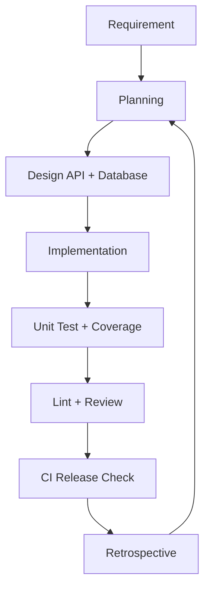

# Báo cáo SPQM Level 1 - Quản lý phòng trọ

## 1. Quy trình phát triển phần mềm theo SDLC

Nhóm áp dụng quy trình SDLC rút gọn, phù hợp mini project:

1. Requirement: thu thập yêu cầu quản lý phòng, người thuê, hợp đồng và hóa đơn.
2. Planning: chia backlog, xác định độ ưu tiên và phạm vi Level 1.
3. Design: thiết kế REST API, database schema SQLite và cấu trúc thư mục.
4. Implementation: xây dựng Express API, service layer và database model.
5. Testing: viết unit test cho service chính và kiểm tra coverage.
6. Review: kiểm tra lint, format, logic nghiệp vụ và tài liệu.
7. Release: merge vào nhánh chính sau khi CI pass.
8. Retrospective: đánh giá sprint, xác định điểm cải tiến.

## 2. Vai trò thành viên trong nhóm

| Vai trò | Trách nhiệm |
| --- | --- |
| Project Lead | Quản lý phạm vi, tiến độ, Definition of Done |
| Backend Developer | Xây dựng REST API, service, database |
| QA Engineer | Viết test case, kiểm tra coverage, xác nhận lỗi |
| Process Owner | Theo dõi SDLC, baseline, retrospective và PDCA |
| Technical Writer | Cập nhật README, API docs và báo cáo SPQM |

Với nhóm ít thành viên, một người có thể kiêm nhiều vai trò nhưng trách nhiệm vẫn cần được phân tách rõ.

## 3. Backlog chức năng

| ID | User story | Ưu tiên | Acceptance criteria |
| --- | --- | --- | --- |
| BL-01 | Là chủ trọ, tôi muốn thêm phòng để quản lý danh sách phòng. | High | Tạo phòng có tên, giá, trạng thái hợp lệ |
| BL-02 | Là chủ trọ, tôi muốn xem danh sách và chi tiết phòng. | High | API trả về danh sách và chi tiết theo id |
| BL-03 | Là chủ trọ, tôi muốn cập nhật hoặc xóa phòng. | High | Cập nhật trường hợp lệ, xóa phòng chưa bị ràng buộc |
| BL-04 | Là chủ trọ, tôi muốn quản lý người thuê. | High | CRUD người thuê đầy đủ |
| BL-05 | Là chủ trọ, tôi muốn tạo hợp đồng thuê phòng. | High | Chỉ tạo khi phòng đang trống, phòng chuyển sang đã thuê |
| BL-06 | Là chủ trọ, tôi muốn kết thúc hợp đồng. | High | Hợp đồng chuyển ended, phòng chuyển available |
| BL-07 | Là chủ trọ, tôi muốn tạo hóa đơn tháng. | High | Tổng tiền = phòng + điện + nước + dịch vụ |
| BL-08 | Là chủ trọ, tôi muốn cập nhật trạng thái thanh toán. | Medium | Hóa đơn chuyển `paid` hoặc `unpaid` |
| BL-09 | Là nhóm phát triển, tôi muốn CI tự chạy lint và test. | High | GitHub Actions chạy install, lint, test coverage |
| BL-10 | Là giảng viên, tôi muốn xem tài liệu quy trình. | Medium | README và báo cáo SPQM đầy đủ |

## 4. Mục tiêu SMART-Q

| Mục tiêu | Nội dung |
| --- | --- |
| Specific | Hoàn thành REST API quản lý phòng trọ Level 1 gồm phòng, người thuê, hợp đồng, hóa đơn |
| Measurable | Coverage tối thiểu 70%, CI chạy lint và test tự động |
| Achievable | Phạm vi giới hạn ở CRUD và logic hóa đơn cơ bản |
| Relevant | Phù hợp môn Software Process and Quality Management vì có SDLC, DoD, baseline và CI |
| Time-bound | Hoàn thành trong 1 sprint đầu tiên của mini project |
| Quality | API JSON thống nhất, service tách khỏi route, có xử lý lỗi tập trung |

## 5. Definition of Done

- Mã nguồn nằm đúng cấu trúc `routes`, `controllers`, `services`, `models`, `tests`.
- API đáp ứng đủ phạm vi Level 1.
- Dữ liệu đầu vào được validation cơ bản.
- Logic nghiệp vụ nằm trong service.
- Lỗi được xử lý tập trung qua middleware.
- Unit test bao phủ logic chính: tạo phòng, cập nhật trạng thái phòng, tạo hợp đồng, kết thúc hợp đồng, tính hóa đơn.
- Coverage toàn cục đạt tối thiểu 70%.
- `npm run lint` pass.
- GitHub Actions CI được cấu hình.
- README và báo cáo SPQM được cập nhật.

## 6. Commit convention

Nhóm dùng Conventional Commits:

| Prefix | Mục đích | Ví dụ |
| --- | --- | --- |
| feat | Thêm chức năng | `feat: add invoice api` |
| fix | Sửa lỗi | `fix: validate room status` |
| test | Thêm/sửa test | `test: add contract service tests` |
| docs | Cập nhật tài liệu | `docs: add spqm baseline` |
| ci | Thay đổi CI | `ci: run jest coverage` |
| refactor | Cải tiến code không đổi hành vi | `refactor: split room service` |

## 7. Baseline đo lường chất lượng

| Chỉ số | Baseline mục tiêu | Cách đo |
| --- | --- | --- |
| Coverage | >= 70% | Jest coverage |
| Số lỗi nghiêm trọng mở | 0 | Issue tracker hoặc checklist nhóm |
| Số lỗi lint | 0 | `npm run lint` |
| Lead time cho story nhỏ | <= 2 ngày | Thời gian từ bắt đầu đến Done |
| CI fail rate | <= 20% mỗi sprint | Số lần CI fail / tổng số lần chạy CI |
| API có tài liệu | 100% API Level 1 | README API table |

Baseline sprint 1 đề xuất:

| Chỉ số | Giá trị sau sprint 1 |
| --- | --- |
| Coverage | >= 70% theo cấu hình Jest |
| Lỗi lint | 0 trước khi merge |
| Lỗi critical | 0 |
| Lead time trung bình | 1-2 ngày/story nhỏ |
| CI fail rate | Theo dõi sau khi push lên GitHub |

## 8. Tự đánh giá CMMI mức 1-2

| Khu vực | Mức hiện tại | Bằng chứng |
| --- | --- | --- |
| Requirements Management | Level 2 sơ khởi | Có backlog, acceptance criteria và phạm vi Level 1 |
| Project Planning | Level 2 sơ khởi | Có SDLC, vai trò, mục tiêu SMART-Q |
| Process and Product Quality Assurance | Level 2 sơ khởi | Có ESLint, Jest, coverage threshold và CI |
| Configuration Management | Level 1-2 | Có commit convention và GitHub Actions, cần bổ sung branch protection |
| Measurement and Analysis | Level 1-2 | Có baseline chất lượng, cần thu thập dữ liệu thật qua nhiều sprint |

Kết luận: dự án vượt mức hỗn loạn của CMMI Level 1 ở một số thực hành cơ bản, nhưng chưa đủ dữ liệu vận hành để khẳng định Level 2 hoàn chỉnh. Nhóm đang ở trạng thái chuyển tiếp từ Level 1 sang Level 2.

## 9. Retrospective sau sprint đầu tiên

| Nội dung | Ghi nhận |
| --- | --- |
| Làm tốt | Phạm vi rõ, API được tách lớp, có test và CI ngay từ đầu |
| Chưa tốt | Chưa có dữ liệu CI fail rate thực tế, chưa có kiểm thử tích hợp đầy đủ cho mọi endpoint |
| Bài học | Nên thiết kế schema và API trước khi code để tránh sửa nhiều |
| Hành động tiếp theo | Bổ sung test API cho tenants, contracts, invoices và thêm seed data demo |

## 10. Kế hoạch cải tiến quy trình theo PDCA

| Giai đoạn | Hành động |
| --- | --- |
| Plan | Đặt mục tiêu sprint 2: tăng coverage lên 80%, thêm integration test cho API chính |
| Do | Viết thêm test endpoint, chuẩn hóa dữ liệu lỗi, thêm checklist review |
| Check | Theo dõi coverage, lint, CI fail rate và số lỗi sau mỗi pull request |
| Act | Cập nhật Definition of Done, bổ sung rule review nếu lỗi lặp lại |

## 11. Bằng chứng kỹ thuật

- Source code có cấu trúc rõ trong `src`.
- Database schema SQLite được định nghĩa trong `src/models/database.js`.
- Business logic nằm trong `src/services`.
- Unit test nằm trong `tests`.
- CI nằm trong `.github/workflows/ci.yml`.
- Coverage threshold nằm trong `package.json`.
