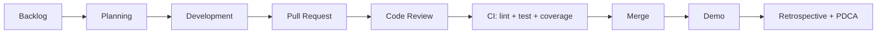

# Boarding House Management

Mini project mon **Software Process and Quality Management** voi de tai **Quan ly phong tro**. He thong ho tro quan ly phong tro/chung cu mini theo 3 level: REST API nen tang, mo rong auth/CI/chat luong, va nang cao theo huong microservices/monitoring.

Repository: `https://github.com/dungdao150L/Boarding-House-Management`

## Cong nghe

- Backend: Node.js, Express
- Frontend: React, Vite, TypeScript
- Database: MySQL, dung tot voi XAMPP
- Auth: JWT, phan quyen `admin`, `staff`, `tenant`
- Testing: Jest, Supertest
- Quality: ESLint, SonarQube config
- Service phu: Python FastAPI billing service
- Level 3: Redis, k6, Prometheus, Grafana, Docker Compose

## Chuc nang chinh

- Dang ky, dang nhap, xac thuc JWT
- Quan ly phong: them, xem, sua, xoa, trang thai phong
- Quan ly nguoi thue
- Quan ly hop dong thue phong
- Quan ly dien nuoc va hoa don
- Nguoi thue gui yeu cau chon phong
- Admin phe duyet yeu cau thue phong
- Nguoi thue xem phong, hop dong, hoa don cua minh
- Bao cao doanh thu, phong trong, hoa don chua thanh toan

## Cau truc thu muc

```text
.
+-- src/                         # Backend Node.js
|   +-- controllers/
|   +-- middlewares/
|   +-- microservices/
|   +-- models/
|   +-- routes/
|   +-- services/
|   +-- utils/
+-- giaodien/                    # Frontend React/Vite
+-- billing-service/             # FastAPI billing calculator
+-- tests/                       # Jest + Supertest
+-- docs/                        # Tai lieu SPQM level 1-3
+-- migrations/                  # Script/schema database
+-- monitoring/                  # Prometheus/Grafana
+-- load-tests/                  # k6 scripts
+-- Lv1/                         # Ban Level 1
+-- quan_ly_phong_tro_xampp_mysql.sql
+-- docker-compose.yml
+-- README.md
```

## Yeu cau truoc khi chay

- Node.js LTS
- XAMPP, bat MySQL
- Git
- Docker Desktop neu muon chay Docker Compose

## Cai dat tren Windows voi XAMPP

1. Tai code ve may:

```powershell
git clone https://github.com/dungdao150L/Boarding-House-Management.git
cd Boarding-House-Management
```

2. Cai thu vien backend:

```powershell
npm install
```

3. Cai thu vien frontend:

```powershell
cd giaodien
npm install
cd ..
```

4. Tao file moi truong:

```powershell
copy .env.example .env
```

5. Mo XAMPP va bat MySQL.

6. Vao phpMyAdmin:

```text
http://localhost/phpmyadmin
```

Tao database:

```sql
quan_ly_phong_tro
```

Sau do import file:

```text
quan_ly_phong_tro_xampp_mysql.sql
```

## Cau hinh `.env`

Mac dinh cho XAMPP:

```env
DB_HOST=localhost
DB_PORT=3306
DB_NAME=quan_ly_phong_tro
DB_USER=root
DB_PASSWORD=
JWT_SECRET=replace-this-secret
REDIS_URL=redis://localhost:6379
```

Neu MySQL cua ban co mat khau root, sua `DB_PASSWORD`.

## Chay project

Chay toan bo backend services va frontend bang 1 lenh:

```powershell
npm run dev:all
```

Mo trinh duyet:

```text
http://localhost:5173
```

Ports mac dinh:

| Thanh phan | Port |
|---|---:|
| Auth service | 3001 |
| Room service | 3002 |
| Report service | 3003 |
| Billing service Node | 3005 |
| Frontend Vite | 5173 |
| FastAPI billing calculator | 8000 |
| Prometheus | 9090 |
| Grafana | 3004 |
| SonarQube | 9000 |

## Tai khoan mau

```text
Username: admin
Password: Admin@123
Role: admin
```

Nguoi dung moi dang ky tren giao dien se co role `tenant`. Tenant can gui yeu cau chon phong, sau do admin phe duyet trong trang quan ly.

## Lenh huu ich

```powershell
npm run lint
npm test -- --runInBand
npm run test:unit
npm run test:integration
npm run frontend:lint
npm run frontend:build
```

Coverage yeu cau Level 2-3: toi thieu 80%.

## Chay bang Docker Compose

```powershell
copy .env.example .env
docker compose up --build
```

Sau khi container chay:

- Frontend: `http://localhost:5173`
- Prometheus: `http://localhost:9090`
- Grafana: `http://localhost:3004`
- SonarQube: `http://localhost:9000`

Grafana mac dinh:

```text
Username: admin
Password: admin
```

## API chinh

Tat ca API tra ve JSON thong nhat:

```json
{
  "success": true,
  "message": "Message",
  "data": {}
}
```

### Auth

| Method | Endpoint | Mo ta |
|---|---|---|
| POST | `/api/auth/register` | Dang ky tai khoan |
| POST | `/api/auth/login` | Dang nhap, tra ve JWT |
| GET | `/api/auth/me` | Lay user hien tai |
| GET | `/api/auth/users` | Admin xem danh sach user |
| POST | `/api/auth/users` | Admin tao user |

### Rooms

| Method | Endpoint | Mo ta |
|---|---|---|
| GET | `/api/rooms` | Danh sach phong |
| POST | `/api/rooms` | Tao phong |
| GET | `/api/rooms/:id` | Chi tiet phong |
| PUT | `/api/rooms/:id` | Cap nhat phong |
| DELETE | `/api/rooms/:id` | Xoa phong |
| GET | `/api/rooms/available` | Tenant xem phong trong |
| POST | `/api/rooms/rental-requests` | Tenant gui yeu cau thue phong |
| GET | `/api/rooms/rental-requests` | Admin xem yeu cau thue |
| PATCH | `/api/rooms/rental-requests/:id` | Admin duyet/tu choi yeu cau |

### Tenants

| Method | Endpoint | Mo ta |
|---|---|---|
| GET | `/api/tenants` | Danh sach nguoi thue |
| POST | `/api/tenants` | Tao nguoi thue |
| GET | `/api/tenants/:id` | Chi tiet nguoi thue |
| PUT | `/api/tenants/:id` | Cap nhat nguoi thue |
| DELETE | `/api/tenants/:id` | Xoa nguoi thue |

### Contracts

| Method | Endpoint | Mo ta |
|---|---|---|
| GET | `/api/contracts` | Danh sach hop dong |
| POST | `/api/contracts` | Tao hop dong |
| GET | `/api/contracts/:id` | Chi tiet hop dong |
| PUT | `/api/contracts/:id` | Cap nhat hop dong |
| PATCH | `/api/contracts/:id/end` | Ket thuc hop dong |

### Invoices

| Method | Endpoint | Mo ta |
|---|---|---|
| GET | `/api/invoices` | Danh sach hoa don |
| POST | `/api/invoices` | Tao hoa don |
| GET | `/api/invoices/:id` | Chi tiet hoa don |
| PUT | `/api/invoices/:id` | Cap nhat hoa don |
| PATCH | `/api/invoices/:id/payment-status` | Cap nhat thanh toan |

### Tenant self-service

| Method | Endpoint | Mo ta |
|---|---|---|
| GET | `/api/me/room` | Xem phong dang thue |
| GET | `/api/me/contracts` | Xem hop dong cua minh |
| GET | `/api/me/invoices` | Xem hoa don cua minh |
| PATCH | `/api/me/invoices/:id/pay` | Tenant thanh toan hoa don |

### Reports

| Method | Endpoint | Mo ta |
|---|---|---|
| GET | `/api/reports/revenue?month=YYYY-MM` | Bao cao doanh thu |
| GET | `/api/reports/unpaid-invoices` | Hoa don chua thanh toan |
| GET | `/api/reports/room-occupancy` | Ti le phong |

## Quy trinh SPQM

Tai lieu chi tiet nam trong `docs/`:

- `docs/spqm-level-1.md`
- `docs/spqm-level-2.md`
- `docs/spqm-level-3.md`
- `docs/tong-hop-3-level.md`

Tom tat quy trinh:



Definition of Done:

- Chuc nang dung yeu cau
- Co validation va xu ly loi
- Lint pass
- Test pass
- Coverage >= 80% voi Level 2-3
- CI pass
- README/API/docs duoc cap nhat neu co thay doi

Commit convention:

```text
feat: them chuc nang moi
fix: sua loi
docs: cap nhat tai lieu
test: them/sua test
refactor: cai tien code khong doi hanh vi
chore: cau hinh, build, package
```

## Phan cong nhom

- Dung: backend Node.js, API, services, tests
- Hoang: billing service, Docker, CI, SonarQube, monitoring, load test
- Nam: frontend React/Vite, giao dien admin va user

## Luu y khi day GitHub

Khong day cac file sinh tu dong hoac file rieng may:

- `node_modules/`
- `coverage/`
- `.env`
- `.codegraph/`
- `dist/`

Da co `.gitignore` cho cac muc tren. Khi clone ve may khac, chi can chay lai `npm install`.
