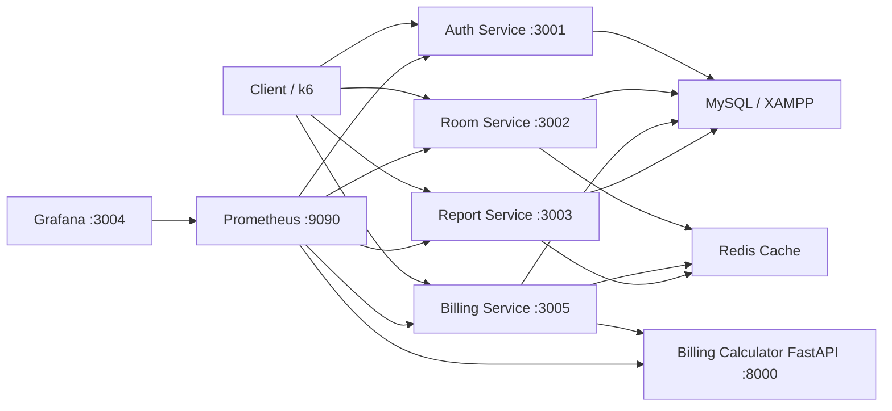

# Quản lý phòng trọ - SPQM Level 3

Mini project môn **Software Process and Quality Management**. Level 3 nâng hệ thống từ kiến trúc Level 2 lên microservices, có Redis cache, Prometheus/Grafana monitoring, k6 load test, Quality Gate tự động và báo cáo cải tiến dựa trên số liệu.

## Kiến trúc microservices



Service chính:

| Service | Port | Trách nhiệm |
| --- | --- | --- |
| Auth Service | 3001 | Đăng ký, đăng nhập, JWT, user/role |
| Room Service | 3002 | Phòng, người thuê, hợp đồng, trạng thái phòng |
| Billing Service | 3005 | Hóa đơn, thanh toán, gọi billing calculator |
| Billing Calculator | 8000 | FastAPI tính tiền điện/nước/dịch vụ |
| Report Service | 3003 | Doanh thu tháng, hóa đơn chưa thanh toán, tỉ lệ phòng |
| Frontend UI | 5173 | Giao diện React/Vite quản lý phòng trọ |
| Redis | 6379 | Cache API đọc nhiều |
| Prometheus | 9090 | Thu thập metrics |
| Grafana | 3004 | Dashboard quan sát |
| SonarQube | 9000 | Quality analysis |

## Database MySQL / XAMPP

Backend Node.js hien da chuyen sang MySQL va dung schema trong file:

```text
quan_ly_phong_tro_xampp_mysql.sql
```

Thong tin ket noi mac dinh trong `.env`:

```text
DB_HOST=localhost
DB_PORT=3306
DB_NAME=quan_ly_phong_tro
DB_USER=root
DB_PASSWORD=
```

Neu MySQL XAMPP cua ban co mat khau, cap nhat lai `DB_PASSWORD`.
Co the import file SQL bang phpMyAdmin, sau do chay `npm run seed` de dam bao tai khoan `admin / Admin@123` co password hash dung.

## Redis cache

Các dữ liệu được cache:

- `rooms:list`: danh sách phòng.
- `report:revenue:<month>`: doanh thu tháng.
- `report:unpaid-invoices`: hóa đơn chưa thanh toán.
- `report:room-occupancy`: tỉ lệ phòng trống/đã thuê/bảo trì.

Cache được xóa khi tạo/cập nhật/xóa phòng, tạo/kết thúc hợp đồng, tạo/cập nhật/thanh toán hóa đơn.

## Chạy bằng Docker Compose

```bash
docker compose up --build
```

Sau khi chạy:

- Auth: `http://localhost:3001`
- Room: `http://localhost:3002`
- Billing: `http://localhost:3005`
- Billing Calculator: `http://localhost:8000`
- Report: `http://localhost:3003`
- Frontend UI: `http://localhost:5173`
- Prometheus: `http://localhost:9090`
- Grafana: `http://localhost:3004` với `admin/admin`
- SonarQube: `http://localhost:9000`

Seed admin:

```text
username: admin
password: Admin@123
```

Frontend UI đã được nối với backend thật qua các biến môi trường Vite:

```text
VITE_AUTH_API_URL=http://localhost:3001
VITE_ROOM_API_URL=http://localhost:3002
VITE_BILLING_API_URL=http://localhost:3005
VITE_REPORT_API_URL=http://localhost:3003
```

Khi mở `http://localhost:5173`, đăng nhập bằng tài khoản seed `admin / Admin@123`. Giao diện sẽ gọi API thật, lưu JWT và tải dữ liệu phòng, người thuê, hợp đồng, hóa đơn từ MySQL thông qua các service backend.

## Chạy test

```bash
npm install
npm run lint
npm run test:unit
npm run test:integration
npm test
npm run frontend:lint
npm run frontend:build
```

Kết quả kiểm tra hiện tại:

```text
35 tests passed
Statements 93.76%
Branches 80.33%
Functions 96.39%
Lines 93.63%
```

## Chạy k6 load test

Cần hệ thống Docker Compose đang chạy và có dữ liệu hợp đồng mẫu.

```bash
k6 run load-tests/boarding-house.js
```

Có thể truyền biến môi trường:

```bash
k6 run ^
  -e AUTH_URL=http://localhost:3001 ^
  -e ROOM_URL=http://localhost:3002 ^
  -e BILLING_URL=http://localhost:3005 ^
  -e REPORT_URL=http://localhost:3003 ^
  -e CONTRACT_ID=1 ^
  load-tests/boarding-house.js
```

Chỉ số k6 cần ghi vào báo cáo:

- Average response time.
- p95 response time.
- Requests per second.
- Error rate.
- So sánh trước/sau bật Redis.

## Prometheus

Mỗi service expose:

```text
/metrics
```

Prometheus scrape config: [monitoring/prometheus.yml](/E:/doAn/monitoring/prometheus.yml)

Mở Prometheus:

```text
http://localhost:9090
```

Query mẫu:

```promql
sum(rate(boarding_http_requests_total[5m])) by (service)
histogram_quantile(0.95, sum(rate(boarding_http_request_duration_seconds_bucket[5m])) by (le, service))
sum(rate(boarding_http_requests_total{status_code=~"5.."}[5m])) / sum(rate(boarding_http_requests_total[5m]))
```

## Grafana

Dashboard được provision tự động:

[monitoring/grafana/dashboards/boarding-house-overview.json](/E:/doAn/monitoring/grafana/dashboards/boarding-house-overview.json)

Mở Grafana:

```text
http://localhost:3004
```

Theo dõi:

- Requests per second.
- p95 response time.
- Error rate.
- Trạng thái service qua target Prometheus.

## Quality Gate

CI fail nếu:

- ESLint fail.
- Unit test fail.
- Integration test fail.
- Coverage dưới 80%.
- SonarQube Quality Gate fail khi repo có `SONAR_TOKEN` và `SONAR_HOST_URL`.

CI config: [.github/workflows/ci.yml](/E:/doAn/.github/workflows/ci.yml)

Sonar config: [sonar-project.properties](/E:/doAn/sonar-project.properties)

## Chỉ số Level 3

SLO đề xuất:

- 95% request có response time dưới 500ms.
- Error rate dưới 1%.
- CI pass rate trên 90%.
- p95 API đọc có cache dưới 300ms.

DORA metrics cần thu thập:

- Deployment frequency.
- Lead time for changes.
- Change failure rate.
- Mean time to recovery.

## Link video demo

Thêm link video demo sau khi quay:

```text
https://example.com/spqm-level-3-demo
```

## Báo cáo SPQM Level 3

Xem: [docs/spqm-level-3.md](/E:/doAn/docs/spqm-level-3.md)
