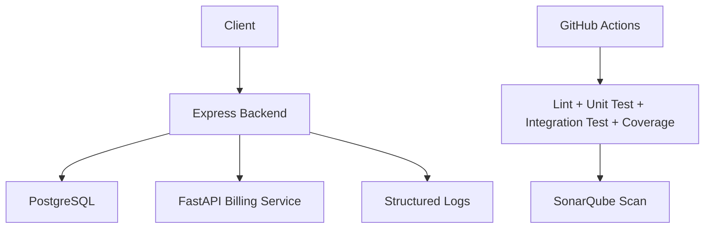
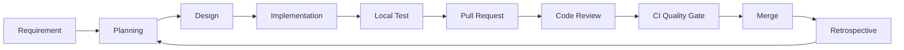

# Báo cáo SPQM Level 2 - Quản lý phòng trọ

## 1. Phân tích thay đổi từ Level 1 lên Level 2

Level 1 tập trung nền tảng: CRUD, SQLite, unit test, ESLint, CI cơ bản và tài liệu. Level 2 mở rộng theo hướng quy trình có kiểm soát hơn: auth, phân quyền, PostgreSQL, service phụ, Docker Compose, integration test, SonarQube, PR review và đo lường quy trình.

| Tiêu chí | Level 1 | Level 2 |
| --- | --- | --- |
| Database | SQLite | PostgreSQL |
| Auth | Không có | JWT + RBAC |
| Architecture | Monolith API | Backend + billing service |
| Testing | Unit test | Unit + integration test |
| Coverage | >= 70% | >= 80% |
| Quality | ESLint | ESLint + SonarQube |
| Process | SDLC cơ bản | SDLC + PR + review + metrics |

## 2. Kiến trúc Level 2

## 3. Thiết kế database PostgreSQL

Các bảng chính:

- `users`: username, password hash, role, tenant_id.
- `rooms`: thông tin phòng và trạng thái.
- `tenants`: hồ sơ người thuê.
- `contracts`: hợp đồng, tiền cọc, tiền thuê, trạng thái.
- `meter_readings`: chỉ số điện/nước theo tháng.
- `invoices`: hóa đơn, phí, tổng tiền, trạng thái thanh toán.

Ràng buộc chính:

- Phòng chỉ nhận trạng thái `available`, `rented`, `maintenance`.
- Hợp đồng chỉ nhận `active`, `ended`.
- Hóa đơn chỉ nhận `unpaid`, `paid`.
- Hóa đơn không trùng `contract_id` + `month`.

## 4. Thiết kế auth JWT và phân quyền

Role:

| Role | Quyền |
| --- | --- |
| Admin | Quản lý phòng, người thuê, hợp đồng, hóa đơn, user |
| Staff | Quản lý phòng, người thuê, hóa đơn |
| Tenant | Chỉ xem phòng đang thuê, hợp đồng và hóa đơn của mình |

Middleware:

- `authenticate`: kiểm tra Bearer token.
- `authorize`: kiểm tra role.

## 5. Quy trình SDLC Level 2

## 6. Quy trình quản lý thay đổi

1. Mọi thay đổi bắt đầu bằng issue hoặc backlog item.
2. Developer tạo branch riêng.
3. Code phải có test phù hợp.
4. Pull Request mô tả mục tiêu, ảnh hưởng, test đã chạy.
5. Reviewer kiểm tra logic, bảo mật, test, maintainability.
6. CI pass trước khi merge.
7. Sau merge, cập nhật baseline nếu có số liệu mới.

## 7. Pull Request checklist

| Câu hỏi review | Có/Không | Ghi chú |
| --- | --- | --- |
| Chức năng đúng acceptance criteria? |  |  |
| Có validation input? |  |  |
| Có kiểm tra role phù hợp? |  |  |
| Không lộ password/token trong response/log? |  |  |
| Unit/integration test đã bổ sung? |  |  |
| Coverage không giảm dưới 80%? |  |  |
| SonarQube không có bug/vulnerability nghiêm trọng? |  |  |
| README/API docs có cập nhật? |  |  |

## 8. Metrics Level 2

| Chỉ số | Level 1 baseline | Level 2 mục tiêu | Level 2 hiện tại |
| --- | --- | --- | --- |
| Coverage | >= 70% | >= 80% | 94.21% statements, 82.29% branches |
| Số lỗi SonarQube | Chưa đo | 0 blocker/critical | Chờ scan dashboard |
| Lead time commit đến merge | 1-2 ngày/story nhỏ | <= 1 ngày/PR nhỏ | Cần đo qua PR thật |
| CI fail rate | <= 20% | <= 15% | Cần đo qua GitHub Actions |

## 9. So sánh baseline Level 1 và Level 2

| Nội dung | Level 1 | Level 2 |
| --- | --- | --- |
| Coverage gate | 70% | 80% |
| CI | install, lint, test | install, lint, unit, integration, coverage, optional Sonar |
| Security | Không auth | JWT, bcrypt, RBAC |
| Deployment | Local node | Docker Compose multi-service |
| Quality analysis | ESLint | ESLint + SonarQube |
| Process evidence | README + Level 1 report | PR workflow + review checklist + metrics |

## 10. PDCA cải tiến quy trình

Vấn đề: ở Level 1, test chủ yếu là unit test service, chưa kiểm tra đủ API workflow.

| PDCA | Hành động |
| --- | --- |
| Plan | Tăng coverage lên 80%, thêm integration test cho auth và workflow chính |
| Do | Viết Supertest cho login, CRUD phòng, tạo hợp đồng, tạo hóa đơn, thanh toán |
| Check | Chạy Jest coverage và CI gate |
| Act | Cập nhật Definition of Done: PR phải có integration test nếu đổi API |

Số liệu trước/sau:

| Chỉ số | Trước | Sau |
| --- | --- | --- |
| Coverage gate | 70% | 80% |
| Integration test API | Ít | Có workflow auth/room/contract/invoice/payment |
| Quality scan | Chưa có | Có cấu hình SonarQube |

## 11. Tự đánh giá CMMI mức 2-3

| Practice area | Mức tự đánh giá | Bằng chứng |
| --- | --- | --- |
| Requirements Management | Level 2 | Backlog, scope Level 2, acceptance criteria trong API/test |
| Project Planning | Level 2 | SDLC, role, PR workflow, DoD |
| Process and Product Quality Assurance | Level 2 | ESLint, Jest, Supertest, SonarQube config, CI |
| Configuration Management | Level 2 | Branch + PR + commit convention |
| Measurement and Analysis | Level 2 sơ khởi | Coverage, Sonar issues, lead time, CI fail rate |
| Process Definition | Tiệm cận Level 3 | Có quy trình chuẩn hóa nhưng cần áp dụng qua nhiều sprint |

Kết luận: dự án đạt nhiều bằng chứng của CMMI Level 2. Một số yếu tố Level 3 mới ở mức khởi đầu vì cần dữ liệu ổn định qua nhiều sprint và nhiều PR thật.

## 12. Retrospective sprint Level 2

| Nhóm | Nội dung |
| --- | --- |
| Làm tốt | Tách auth/RBAC, chuyển PostgreSQL, thêm billing service, Docker, integration test |
| Chưa tốt | SonarQube cần chạy thật để có số liệu bugs/vulnerabilities/code smells |
| Rủi ro | Docker/SonarQube cần tài nguyên máy cao hơn chạy local thông thường |
| Hành động | Chạy SonarQube sau mỗi sprint, ghi lại ảnh dashboard và số liệu CI |

## 13. Definition of Done Level 2

- API có auth và role phù hợp.
- Business logic nằm trong service.
- PostgreSQL schema/migration được cập nhật.
- Docker Compose chạy được backend, database, billing service.
- Unit và integration test pass.
- Coverage toàn cục đạt tối thiểu 80%.
- ESLint pass.
- PR có mô tả, checklist review và ít nhất 1 approval.
- README và báo cáo SPQM cập nhật.
- SonarQube không có blocker/critical issue trước khi release.

## 14. Bằng chứng kỹ thuật

- JWT/RBAC: `src/services/authService.js`, `src/middlewares/authMiddleware.js`
- PostgreSQL: `src/models/database.js`, `migrations/001_init_postgres.sql`
- Billing service: `billing-service/main.py`
- Docker Compose: `docker-compose.yml`
- Integration test: `tests/app.test.js`
- SonarQube: `sonar-project.properties`
- CI: `.github/workflows/ci.yml`
