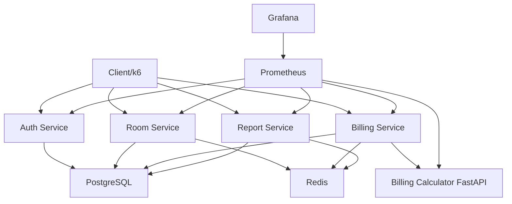

# Báo cáo SPQM Level 3 - Quản lý phòng trọ

## 1. Phân tích tách hệ thống từ Level 2 sang microservices

Level 2 có backend Node.js chính, PostgreSQL, JWT, FastAPI billing calculator, Docker Compose, SonarQube và test coverage 80%. Level 3 tách theo domain để tăng khả năng mở rộng, quan sát và cải tiến hiệu năng:

| Domain | Level 2 | Level 3 |
| --- | --- | --- |
| Auth | Module trong backend | Auth Service riêng |
| Room/Tenant/Contract | Module trong backend | Room Service riêng |
| Invoice/Payment | Module trong backend | Billing Service riêng |
| Calculation | FastAPI phụ | Billing Calculator FastAPI |
| Reporting | Chưa tách | Report Service riêng |
| Cache | Chưa có | Redis |
| Observability | Logs cơ bản | Logs + Prometheus + Grafana |
| Performance | Chưa load test | k6 + so sánh trước/sau cache |

## 2. Kiến trúc Level 3



## 3. Giao tiếp giữa các service

| Từ | Đến | Giao thức | Mục đích |
| --- | --- | --- | --- |
| Client | Auth Service | REST/JSON | Login, register, user |
| Client | Room Service | REST/JSON + JWT | Phòng, người thuê, hợp đồng |
| Client | Billing Service | REST/JSON + JWT | Hóa đơn, thanh toán |
| Billing Service | Billing Calculator | REST/JSON | Tính tổng tiền |
| Report Service | PostgreSQL/Redis | SQL/cache | Báo cáo doanh thu, hóa đơn chưa thanh toán |
| Prometheus | Services | HTTP `/metrics` | Thu thập metrics |

## 4. Database/schema theo service

Dự án dùng một PostgreSQL instance trong Docker Compose để đơn giản hóa triển khai môn học, nhưng ownership được tách theo service:

| Service | Bảng sở hữu |
| --- | --- |
| Auth Service | `users` |
| Room Service | `rooms`, `tenants`, `contracts` |
| Billing Service | `meter_readings`, `invoices` |
| Report Service | Read model từ `rooms`, `contracts`, `invoices`, `tenants` |

Hướng cải tiến tiếp theo: tách database vật lý theo service hoặc thêm schema PostgreSQL riêng như `auth`, `room`, `billing`, `report`.

## 5. Redis cache

Cache API đọc nhiều:

- Danh sách phòng: `rooms:list`.
- Doanh thu tháng: `report:revenue:<month>`.
- Hóa đơn chưa thanh toán: `report:unpaid-invoices`.
- Tỉ lệ phòng: `report:room-occupancy`.

Invalidation:

- Phòng thay đổi: xóa `rooms:*`, `report:*`.
- Hợp đồng thay đổi: xóa `report:*`.
- Hóa đơn/thanh toán thay đổi: xóa `report:*`.

## 6. Metrics và logs

Node.js services dùng Pino structured logs và `prom-client`.

Metrics chính:

- `boarding_http_requests_total`
- `boarding_http_request_duration_seconds`
- Default process metrics như CPU time, memory, event loop.

FastAPI calculator expose:

- `billing_http_requests_total`
- `billing_calculation_duration_seconds`

## 7. Prometheus và Grafana

Prometheus scrape:

- Auth Service `:3001/metrics`
- Room Service `:3002/metrics`
- Billing Service `:3005/metrics`
- Billing Calculator `:8000/metrics`
- Report Service `:3003/metrics`

Grafana dashboard theo dõi:

- Request per second.
- p95 response time.
- Error rate.
- Trạng thái target/service.

## 8. k6 load test

Script: `load-tests/boarding-house.js`.

API được test:

- Login.
- Xem danh sách phòng.
- Tạo hóa đơn.
- Xem báo cáo doanh thu.

Threshold:

```text
avg response time < 500ms
p95 response time < 500ms
error rate < 1%
```

Bảng ghi kết quả:

| Kịch bản | Avg response | p95 | RPS | Error rate | Ghi chú |
| --- | --- | --- | --- | --- | --- |
| Trước Redis | Chưa chạy thực tế | Chưa chạy thực tế | Chưa chạy thực tế | Chưa chạy thực tế | Tắt `REDIS_URL` |
| Sau Redis | Chưa chạy thực tế | Chưa chạy thực tế | Chưa chạy thực tế | Chưa chạy thực tế | Bật Redis |

Kỳ vọng: API đọc như danh sách phòng và báo cáo doanh thu giảm p95 sau khi cache.

## 9. Quality Gate

CI fail nếu:

- ESLint fail.
- Unit test fail.
- Integration test fail.
- Coverage dưới 80%.
- SonarQube Quality Gate fail.

Bằng chứng:

- `.github/workflows/ci.yml`
- `package.json` coverage threshold.
- `sonar-project.properties`

## 10. DORA metrics

| Metric | Định nghĩa | Cách đo |
| --- | --- | --- |
| Deployment frequency | Số lần deploy/merge main mỗi tuần | GitHub releases hoặc merge history |
| Lead time for changes | Thời gian từ commit đầu đến merge PR | GitHub PR timestamps |
| Change failure rate | Tỉ lệ deployment gây lỗi cần rollback/hotfix | Incident log |
| MTTR | Thời gian trung bình khôi phục sau sự cố | Incident start/end time |

Baseline đề xuất cho Level 3:

| Metric | Mục tiêu |
| --- | --- |
| Deployment frequency | >= 1 lần/sprint |
| Lead time | <= 1 ngày cho PR nhỏ |
| Change failure rate | < 15% |
| MTTR | < 2 giờ với lỗi demo/local |

## 11. SLO

| SLO | Mục tiêu |
| --- | --- |
| Latency | 95% request dưới 500ms |
| Error rate | Dưới 1% |
| CI pass rate | Trên 90% |
| Availability demo | Các service health check pass trước demo |

## 12. Retrospective dựa trên dữ liệu

| Dữ liệu | Nhận định | Hành động |
| --- | --- | --- |
| Coverage 93.76% statements, 80.33% branches | Đạt Level 3 gate | Duy trì threshold 80% |
| Redis cache đã thêm | Cần đo k6 thực tế | Chạy load test trước/sau cache |
| Metrics đã expose | Có thể quan sát service | Bổ sung alert rule ở bước sau |
| Sonar Quality Gate đã cấu hình | Cần chạy với server thật | Lưu screenshot dashboard |

## 13. CMMI Level 3 tự đánh giá

| Practice area | Mức | Bằng chứng |
| --- | --- | --- |
| Process Definition | Level 3 sơ khởi | SDLC, PR review, Quality Gate, monitoring |
| Process Focus | Level 3 sơ khởi | PDCA/ODA, retrospective dựa trên metrics |
| Technical Solution | Level 3 sơ khởi | Microservices, Redis, Prometheus/Grafana |
| Verification | Level 3 | Unit/integration test, coverage gate |
| Measurement and Analysis | Level 3 sơ khởi | DORA, SLO, k6 metrics, Grafana |

Kết luận: dự án có bằng chứng kỹ thuật và quy trình tiệm cận CMMI Level 3 trong phạm vi môn học. Cần thêm dữ liệu vận hành nhiều sprint để khẳng định trưởng thành ổn định.

## 14. Kế hoạch cải tiến theo ODA

| ODA | Nội dung |
| --- | --- |
| Observe | Thu thập k6, Prometheus, Grafana, CI pass rate, Sonar issues |
| Decide | Chọn điểm nghẽn: endpoint p95 cao, error rate cao, cache miss cao |
| Act | Tối ưu query, tăng cache TTL, thêm index, thêm alert |

Kế hoạch tiếp theo:

1. Chạy k6 trước/sau Redis và cập nhật bảng kết quả.
2. Thêm alert Prometheus cho error rate > 1%.
3. Tách schema PostgreSQL theo service.
4. Thêm API Gateway để gom entrypoint client.
5. Tự động lưu báo cáo k6 vào artifact CI.
